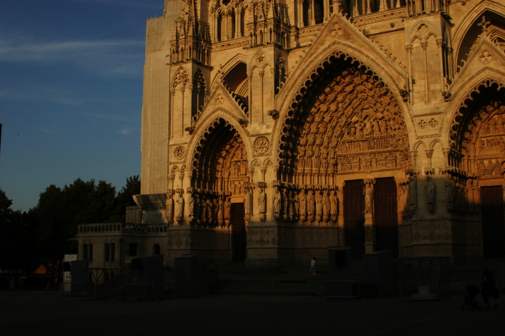
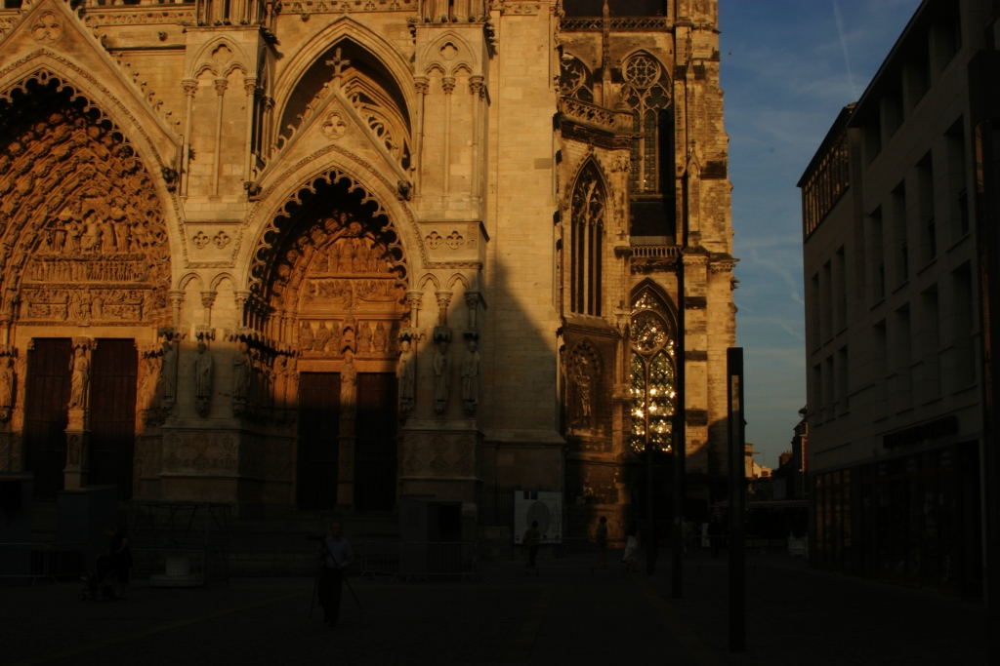
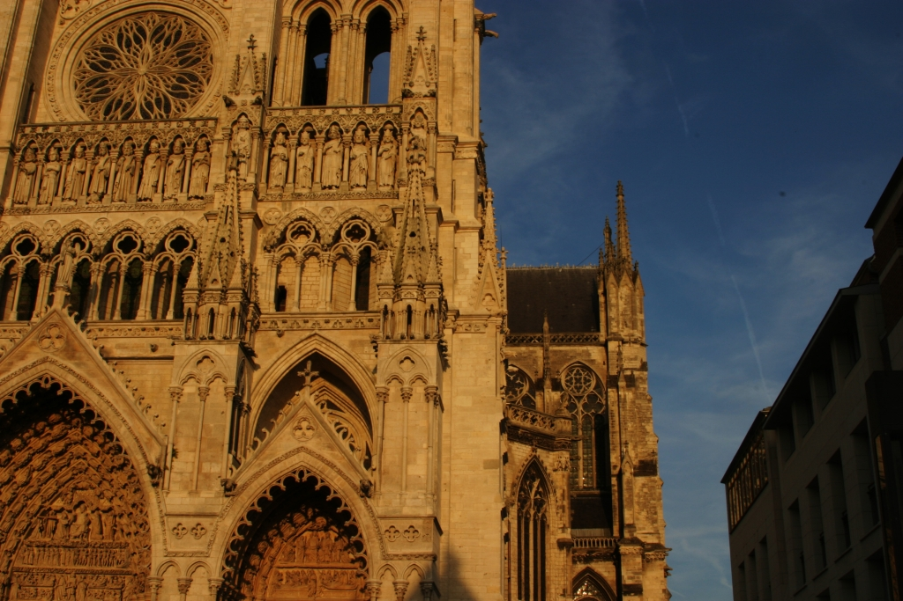
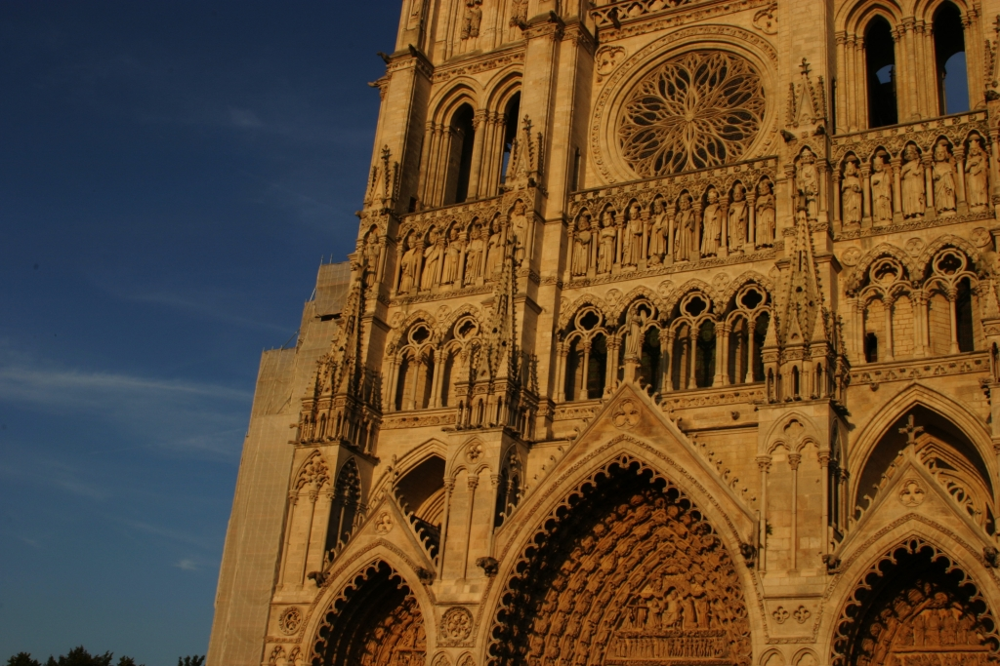
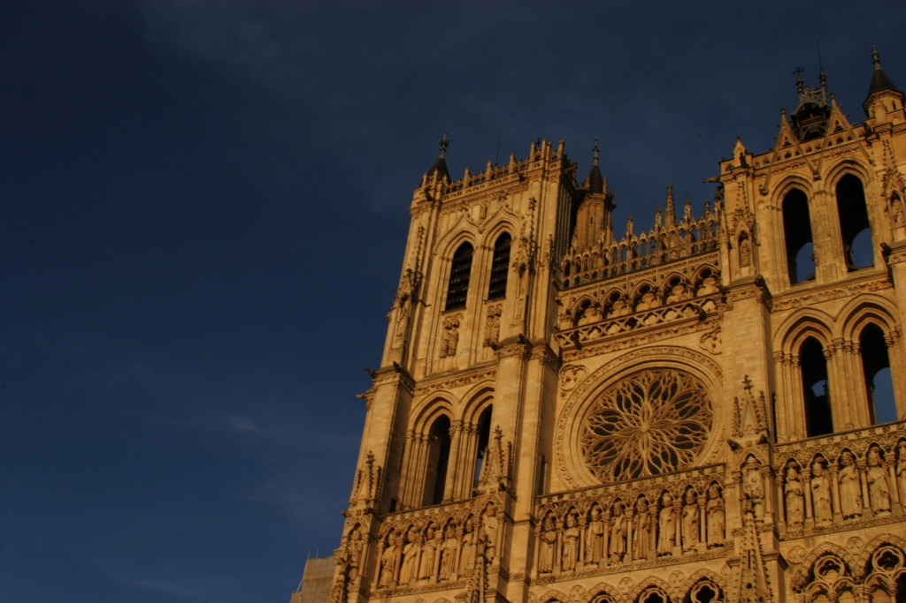
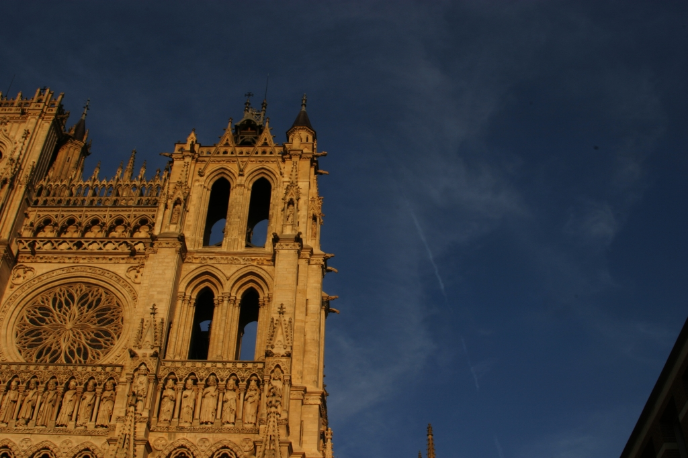

A Panorama Stitching
===============
Detecting and matching the key points using the OpenCV library.

The input images are as following:

     
     
     

     
     
     
      Fig.1 Input Images

