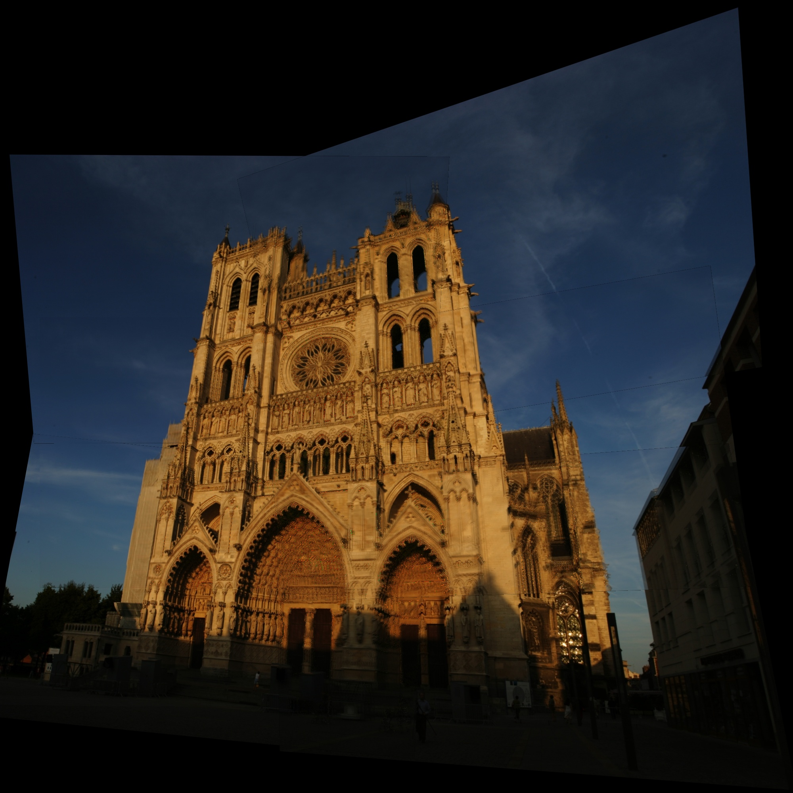

A Panorama Stitching
===============
Detecting and matching the key points using the OpenCV library.

The input images are as following:

     
     
     

     
     
     
      Fig.1 Inputs Images

Feature points detecting and matching result is like figure 2. 

     
      Fig.2 Feature Points Detecting and Matching

The result of stitching is a panorama as figure 3.

     
      Fig.3 Stitching Result

